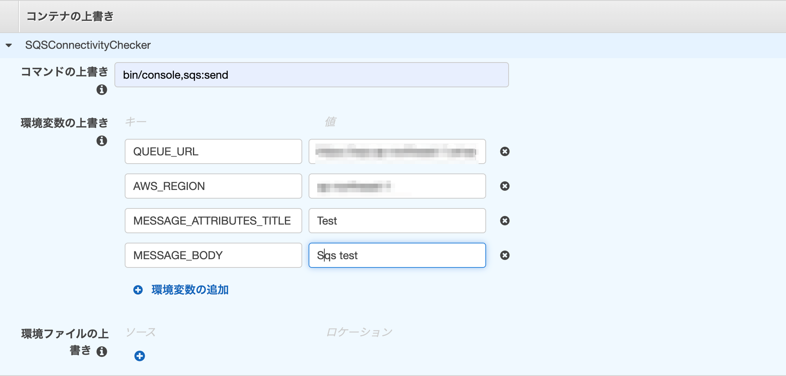

# SQS-Connectivity-Checker

ECRとSQSの疎通を確認します。  

## 環境構築

```shell
$ composer install
```
## 実行方法

- [ローカルで実行](#ローカルで実行)
- [Dockerを使用して実行](#Dockerを使用して実行)
- [ECSタスクとして実行](#ECSタスクとして実行)

## ローカルで実行

- クレデンシャルはローカルの`default`を使用  
  ref. [Configuration and credential file settings](https://docs.aws.amazon.com/cli/latest/userguide/cli-configure-files.html)
- `.env`に変数を設定

### 送信

```shell
$ bin/console sqs:send
````

### 受信

```shell
$ bin/console sqs:receive
````

## Dockerを使用して実行

1. `docker build`でイメージを作成
1.  シェル変数にプロファイルを設定
1. `docker run`でSymfony コマンドを実行

### Dockerイメージを作成

```sh
$ docker build -t {{image_name}} .
```

### シェル変数にプロファイルを設定

シェル変数にリージョンとクレデンシャルを設定します。  
（`default`のプロファイルを使用する場合は以下のように設定できます。）


```shell
# シェル変数にdefualtプロファイルのリージョンとクレデンシャルを設定
AWS_REGION=$(aws configure get region)
AWS_ACCESS_KEY_ID=$(aws configure get aws_access_key_id)
AWS_SECRET_ACCESS_KEY=$(aws configure get aws_secret_access_key)
```


- 参考：[Configuration and credential file settings](https://docs.aws.amazon.com/cli/latest/userguide/cli-configure-files.html)

### 送信

Symfony Command：sqs:send

```shell
# -eでSQSキューのURLと↑でシェル変数に格納したクレデンシャルをコンテナに環境変数として渡す
$ docker run -e QUEUE_URL={{キューURL}} \
             -e MESSAGE_ATTRIBUTES_TITLE={{タイトル}} \ # スペースを含める場合はクウォートで囲む
             -e MESSAGE_BODY={{メッセージボディ}} \ # スペースを含める場合はクウォートで囲む
             -e AWS_REGION=$AWS_REGION \
             -e AWS_ACCESS_KEY_ID=$AWS_ACCESS_KEY_ID \
             -e AWS_SECRET_ACCESS_KEY=$AWS_SECRET_ACCESS_KEY \
             {{image name}} bin/console sqs:send
````

`MESSAGE_ATTRIBUTES_TITLE`、`MESSAGE_BODY`を省略した場合は`.env`ファイルの値が使用されます。

### 受信

Symfony Command：sqs:receive

```shell
# -eでSQSキューのURLと↑でシェル変数に格納したクレデンシャルをコンテナに環境変数として渡す
$ docker run -e QUEUE_URL={{キューURL}} \
             -e AWS_REGION=$AWS_REGION \
             -e AWS_ACCESS_KEY_ID=$AWS_ACCESS_KEY_ID \
             -e AWS_SECRET_ACCESS_KEY=$AWS_SECRET_ACCESS_KEY \
             {{image name}} bin/console sqs:receive
````

## ECSタスクとして実行

1. ECRにリポジトリを作成＆イメージをPush
1. （必要なら）クラスタを作成
1. タスク定義を作成
1. タスクを実行

タスクを実行する際にコンテナの環境変数を上書きします（例:sqs:send）


